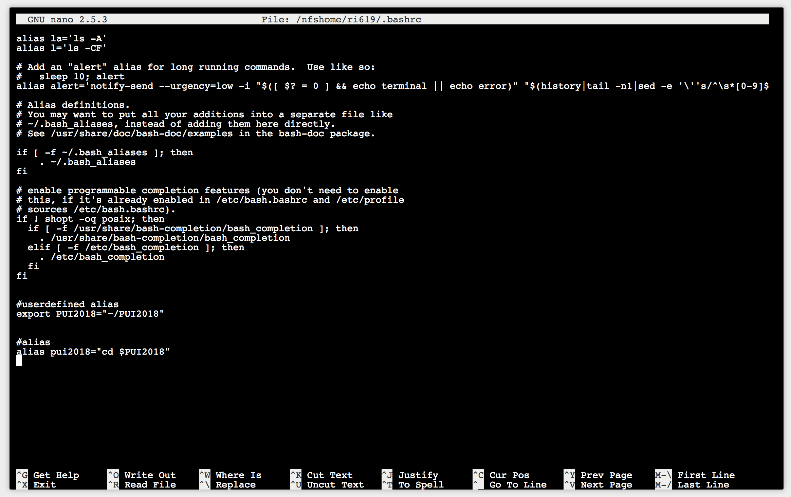
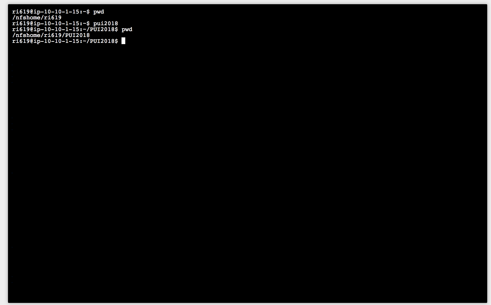

# PUI2018_ri619

This repository holds all relevant code and markdown for HW1 in PUI. This includes an ipython code that produces reproducible random variables. Additionally, this file shows how I set up my environment variables and their usage.

To set up the environment variables, I had to first get into my .bashrc file using the command "nano .bashrc". In the .bashrc file, I set up the environment variable and alias as follows:

To get the .bashrc file to load and have my environment variables ready to use, I had to then run the command "source .bashrc".

Below is an a screenshot of how the alias/environment variables work together and what they accomplish. 

