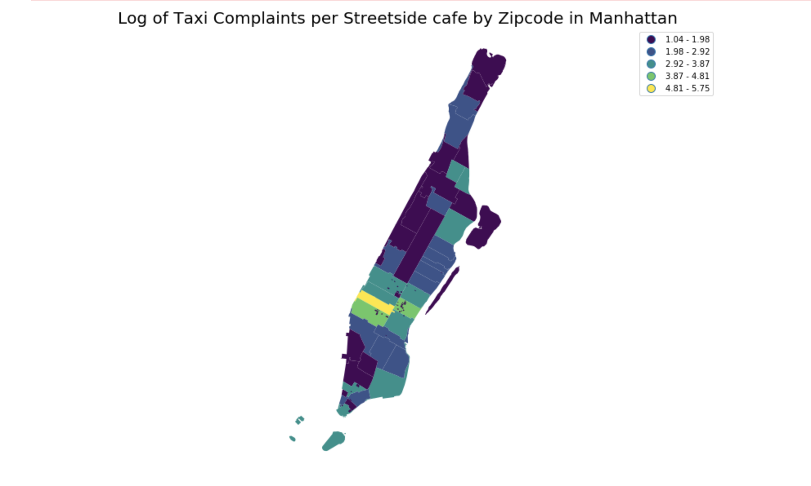

## PUI2018 HW9: Plot review assignment

Rohun Iyer is doing a very good job.

Rohun's plot clearly shows the log of the number of taxi complaints in 2009 per sidewalk cafe license by zip code in Manhattan. 

CLARITY:  This plot is easy to read, and it is very succinct with a clear legend.

ESTHETIC: I think the colors are distinguishable. The quantities being visualized clearly. 

HONESTY: The plot is showing the log of taxi complaints per street side cafe. The plot is not showing the original value. 

nyc_map_final['complaints_per_cafe'] = np.log(nyc_map_final['Complaint Type'] / nyc_map_final['LIC_STATUS'])

Although log is a very good way to narrow the scope down, especially when the order of magnitude is too high to represent, it changes the relative scale. Log is deforming the scale in a sense. 

I highly recommend standardization instead of log. Or we can simply divide by the order of magnitude of the mean of nyc_map_final['complaints_per_cafe'] to decrease the order of magnitude. 