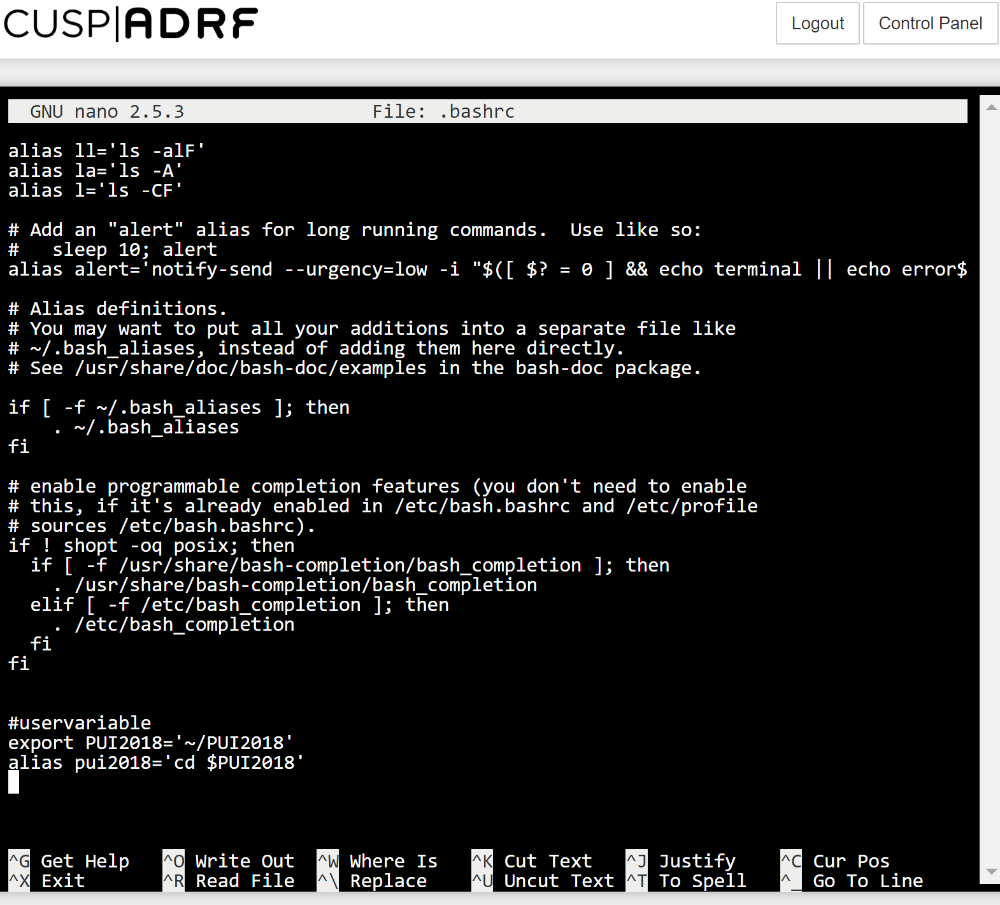
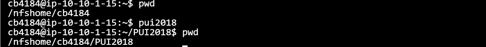

# Homework 1

*I completed this homework independently. Colin Bradley helped me figure out how to embed pictures in this README file*

## Establishing the environment variable and alias
In order to set the environment variable, I had to edit the .bashrc profile on my ADRF home page. This was done using the command 'nano $HOME/.bashrc'. I then added the environment variable using the export function and then called that variable in the following alias 'pui2018'. Note: The shortcuts '~/' & '$HOME' do not work in ADRF for some reason. Instead I had to use a full pathname ('nfshome/cb4184/..')

*This is where I defined my user variable and alias*

## Calling newly defined alias within terminal (ADRF)
After exiting terminal, I had to first run 'source ~/.bashrc' to refresh the profile, so that I could then run my new alias 'PUI2018'. See screenshot for details

*This is where i called my new variable & alias within terminal*

   
