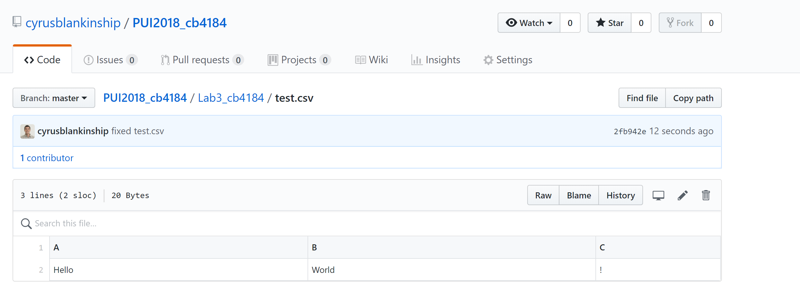
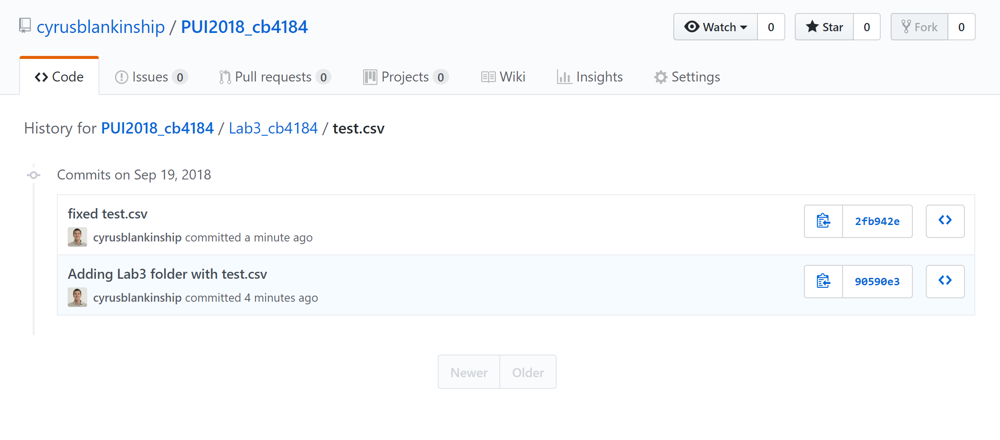
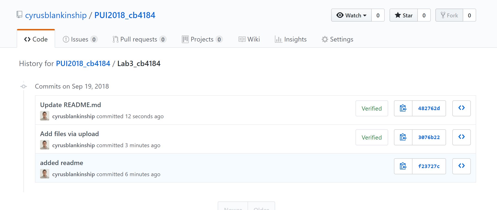

# Week 3
* I worked independently for assigments 1 & 2.
* I collaborated with Colin Bradley (cb4102) & Sam Burns (shb395) on assignments 3 & 4. I also helped Andrew Hill, and Rohun Iyer figure out how to parse the JSON in assignment 3. 

## Assignment 1 - Adding and removing test.csv

*This was the initial test.csv in my Lab3 repo*

*This shows that there was a history*
*However, when I ran the code to remove the file and its cached history, it deleted the entire folder (Lab3_cb4184). This would have been avoided if I added a README.md file to the HW3 directory right way.

*This is the lab history after I deleted the csv file*
**Note:** *While working on this assignment, I put everything under a 'Lab3_cb4184' directory. However, when I changed the name to it's current directory, the history was deleted*
