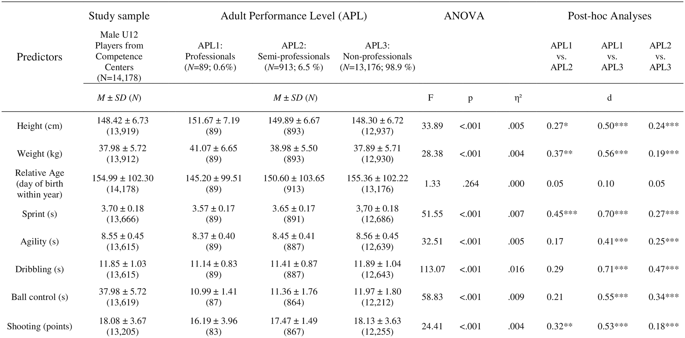
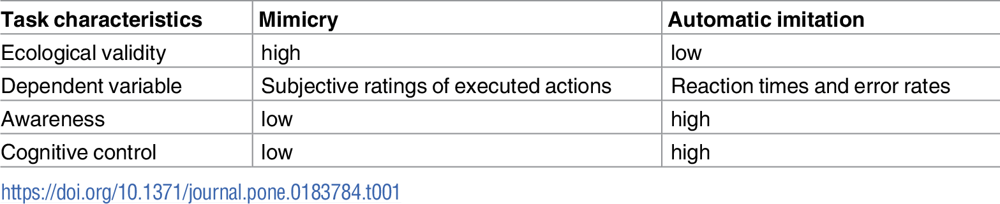
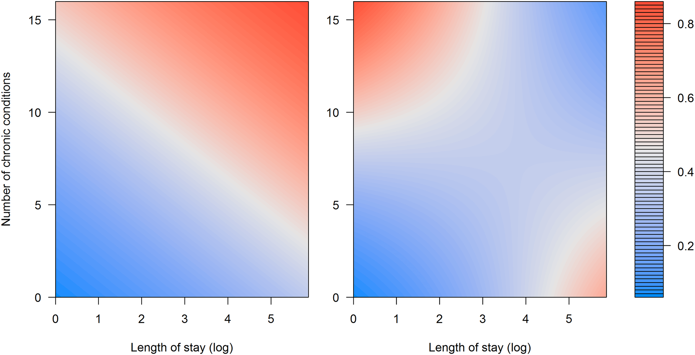

# Week 5 PUI Homework

## Notes
* For assignment 3, I worked with Sam Burns. He forwarded me several articles explaining chi squared tests and i worked independently after that. We then compared our results with one another
* For assignment 4, I worked with Sam Burns & Pablo Barriga to make sense of the different statistical tests and their results. 

## Assignment 1: Reviewing classmates Citibike project proposal
* I was paired with LindaLv11
* After reviewing, I made several suggestions to change the null hypothesis and do a bit more data cleanup.
* I also suggested that she use a Z test for Unpaired data
* I submitted a pull request at 5pm on 10/8/2018

## Assignment 2: Literature choices of statistical tests
* I worked independently on this assignment

| **Statistical Analyses**	|  **IV(s)**  |  **IV type(s)** |  **DV(s)**  |  **DV type(s)**  |  **Control Var** | **Control Var type**  | **Question to be answered** | **$H_0$** | **$\alpha$** | **link to paper**| 
|:----------:|:----------|:------------|:-------------|:-------------|:------------|:------------- |:------------------|:----:|:-------:|:-------|
| MANOVA	| 1, Adult Performance Level | categorical, ordinal, discrete | 5, Motor Tests| continuous, interval | 1, period since test (~9 years) | discrete | 	Which motor test during adolescence is a better predictor of professional success (soccer) | Motor Test Performance has no impact on Adult Performance Level | 0.001 | [The influence of speed abilities and technical skills in early adolescence on adult success in soccer](https://journals.plos.org/plosone/article?id=10.1371/journal.pone.0182211) |
| Correlation| 1, Mimicry Score | continuous | 6, Auto imitation scores| continuous | 1, Order in which tasks were given | discrete | Are mimicry and automatic imitation actually correlated?| $|r_{m,ai}|>0$ | 0.001 | [Mimicry and automatic imitation are not correlated](https://journals.plos.org/plosone/article?id=10.1371/journal.pone.0183784) |
| Logistic Regression | 1, Length of stay | continuous | 1, Number of chronic conditions| discrete | 1, Number of discovered interactions (NDI)| discrete | Can the discovery of comorbities improve predictive performance?| $P_1<P_0$ | n/a | [Comprehensible Predictive Modeling Using Regularized Logistic Regression and Comorbidity Based Features](https://journals.plos.org/plosone/article?id=10.1371/journal.pone.0144439) |

### MANOVA

**Fig 1** Descriptive and inferential statistics for the diagnostics in U12 separated by players’ adult performance level

### Correlation

**Fig 2** Differences between mimicry and automatic imitation tasks.

### Logistic Regression

**Fig 3**. Risk of readmission with and without the interaction term. Surface plot of the response (risk of readmission) from the model without (left) and with interaction between length of stay (LOS_LOG) and number of chronic diseases (NCHRONIC)
