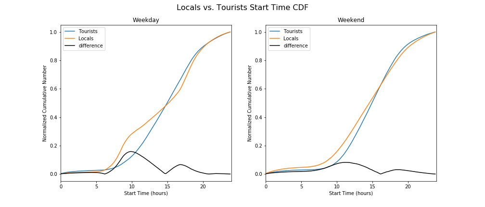

# Homework 8

## Assignment 1

**Figure 1:** These figures show that the start time for tourists vs New Yorkers varies differently on the weekdays. The greatest difference between the two groups (~20%) happens right before 10am, which makes sense because it aligns with the morning commute. Likewise, there is another peak around the evening commute (~17 hours). This relationship is minimized during the weekend, as symbolized by the line of difference. 

      
## Assignment 2
Authorea Article: https://www.authorea.com/335969/dKVM484QAXTryV8n7xfnlg
