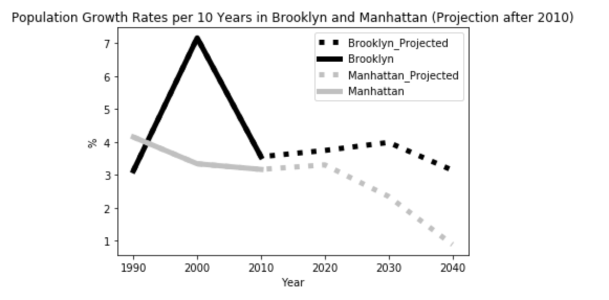

### Assignment 1 Kenji Uchimoto Plot Critique

This plot shows population growth from 1990 - 2010 (and projected afterwards) in Brooklyn and Manhattan. It is relatively easy
to read. I would add a grid to the plot to more clearly show the percent changes in population. Additionally, I think the 
y-axis label could be a little more clear on what it is trying to depict. By choosing to use grey-scale, we are avoiding 
issues with color-blindness, however I think adding color to the plot would enhance the plot and make it more pleasing to read.

This plot is not deforming the data and depicting what it wants to by showing the sharp decrease in population growth in 
Manhattan. Maybe add more data such as the other boroughs or NY state to help bring some comparisons to both Brooklyn and 
Manhattan's changes. 
